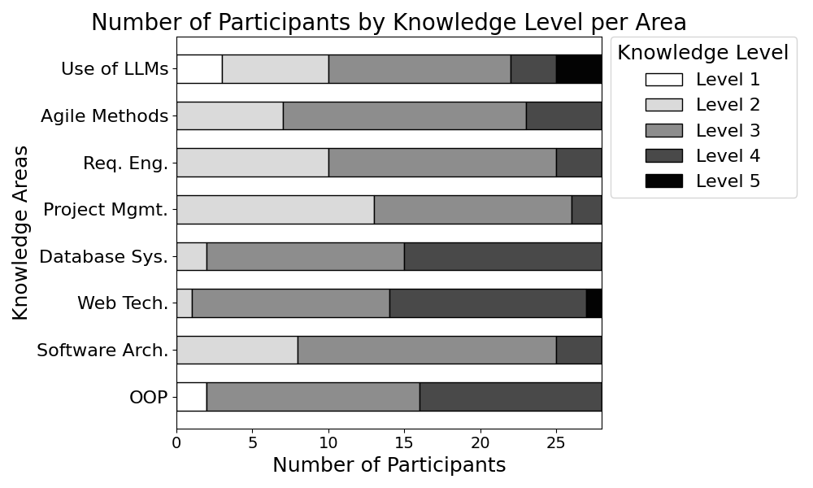
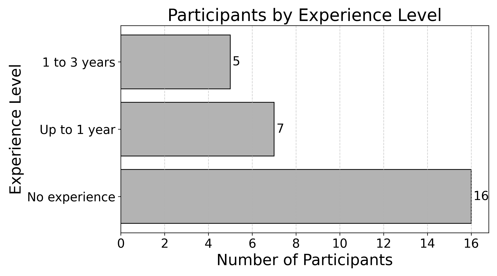
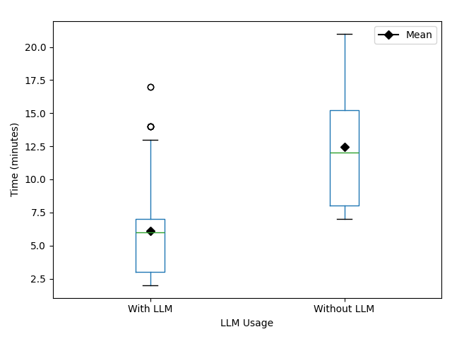
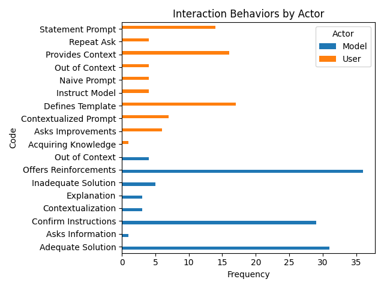
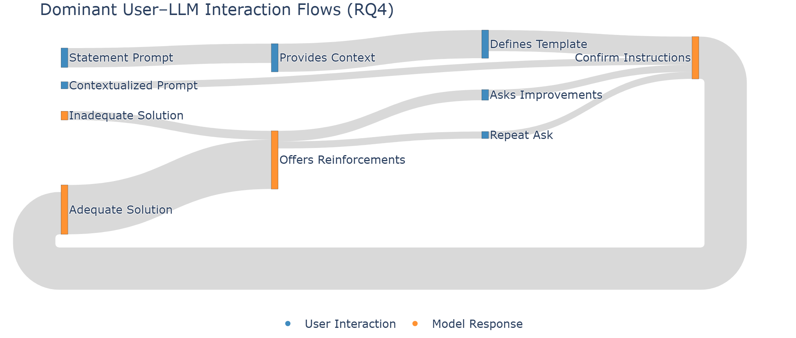

# Client Module – Execution Tutorial

This README provides a **step‑by‑step tutorial** on how to execute and use `main.py`, which is the interactive entry point for generating all graphs and visual analyses used in the study. The client module is responsible for **loading processed data and producing figures** (boxplots, Sankey diagrams, and categorizations) used in the analysis of LLM usage in requirements engineering.

---

## 📁 Folder Structure (Relevant Part)

```
2026-LLMReq/
├── README.md
├── docs/
└── code/
    ├── client/
    │   ├── main.py              # Entry point (interactive)
    │   ├── participants.py      # Participant background analysis
    │   ├── results.py           # Boxplots and statistical results
    │   ├── categorization.py    # Open coding analysis
    │   ├── interactions.py      # Interaction flow Sankey
    │   ├── perception.py        # Positive/Negative perception Sankey
    │   ├── data/                # CSV and processed datasets
    │   ├── figs/                # Generated figures (output)
    │   ├── requirements.txt     # Python dependencies
    │   └── env/                 # (Optional) local virtual environment
```

---

## ⚙️ Environment Setup
> **Note:** The scripts assume a local server api running.

### 1. Create and activate a virtual environment (recommended)
```bash
cd code/client
python3 -m venv env
source env/bin/activate
```
### 2. Install dependencies
```bash
pip install -r requirements.txt
```

---

## ▶️ Running the Application

Once the environment is ready, execute:

```bash
python main.py
```

You should see the following message:

```
This is the main entry point for the client API.
```

And an **interactive menu** will appear.

---

## 🧭 Interactive Menu Overview

The program runs in a loop and asks which graph you want to generate:

```
Do you want to generate any graph?
1  - Knowledge Distribution
2  - Experience Distribution
3  - Boxplot LLM usage by time
4  - Boxplot LLM usage by grade
5  - Specific Knowledge by Topic
6  - Positive LLM usage diagram
7  - Negative LLM usage diagram
8  - Open Coding Categorization
9  - Sankey Diagram
0  - Exit
```

Type the number and press **Enter**.

---

## 📊 Graph Options Explained

### 1️⃣ Knowledge Distribution
```text
Option: 1
```
- Calls `knowledge_distribuition()`
- Produces a distribution of participants' prior knowledge




---

### 2️⃣ Experience Distribution
```text
Option: 2
```
- Calls `experience()`
- Shows participants' experience levels



---

### 3️⃣ Boxplot – LLM Usage by Time
```text
Option: 3
```
- Calls `boxplotLLM("time")`
- Compares LLM usage considering time-related measures



---

### 4️⃣ Boxplot – LLM Usage by Grade
```text
Option: 4
```
- Calls `boxplotLLM("grad_mean")`
- Relates LLM usage to participants' academic grades


---

### 5️⃣ Specific Knowledge by Topic
```text
Option: 5
```
- Calls `specific_knowledge_by_time(topic)`
- Currently fixed topic: `requirements`
- Can be extended for other topics


---

### 6️⃣ Positive LLM Usage Sankey
```text
Option: 6
```
- Calls `build_sankey_positive()`
- Visualizes positive perceptions of LLM usage


---

### 7️⃣ Negative LLM Usage Sankey
```text
Option: 7
```
- Calls `build_sankey_negative()`
- Visualizes negative perceptions (e.g., overdependence, reduced learning)


---
### 8️⃣ Open Coding Categorization
```text
Option: 8
```
- Calls `open_coding_categorization()`
- Generates categorical analysis from open-ended responses



---
### 9️⃣ Interaction Flow Sankey
```text
Option: 9
```
- Calls `sankey_interaction_flows()`
- Shows user–LLM interaction flows as a Sankey diagram



---
### 0️⃣ Exit
```text
Option: 0
```
- Terminates the program
---

## 📂 Output

- Figures are saved in:
  ```
  code/client/figs/
  ```
- Some Sankey diagrams may also open directly in the browser (Plotly)
---